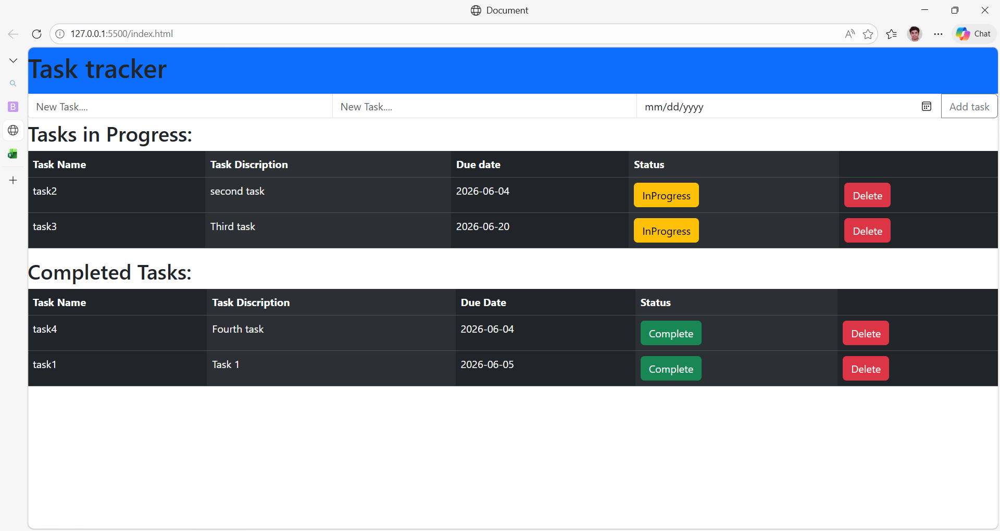

# Task Tracker Application

## Overview 
Task Tracker is a simple and effictive application that allows users to track tasks, record progress(Completed or Inprogress). It has a simple design and local storage capacity in browser.

## Technology Used
> HTML\
> CSS \
> JavaScript \
> Bootstrap

## Features Completed
- Add task
- View task list
- Mark task as completed 
- Delete task

## How to Run
- Open The html File in the web browser
- Click on The input text area
- Add task name and click on Add Task button
- View the Entered tasks and mark and moniter progress

## Challenges Faced
- Interface Designing

## Improvements Planned
- Adding Description For Tasks
- Tags/indication for grouping(imp/casual)
- Database

## Working Image:
